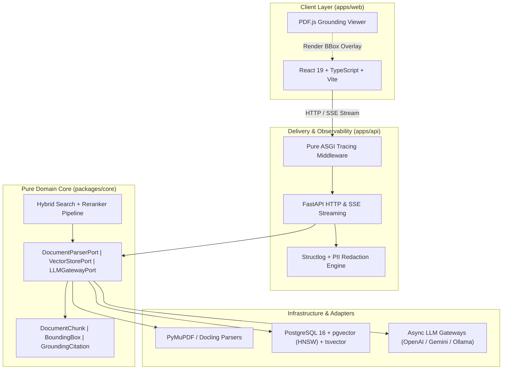

<div align="center">

# 🎓 VeriScholar

**Open-Source, Production-Grade Academic Research & Writing Assistant**  
*Powered by Advanced Hybrid RAG with Strict Multimodal Grounding & Zero-Hallucination Guarantees*

[](LICENSE)
[](https://www.python.org/downloads/)
[](https://github.com/astral-sh/uv)
[](https://fastapi.tiangolo.com)
[](https://react.dev)
[](https://www.typescriptlang.org)
[](https://github.com/astral-sh/ruff)

[Overview](#-overview) •
[Key Features](#-key-features) •
[Architecture](#-architecture) •
[Quickstart](#-quickstart) •
[Quality Gates](#-quality-gates--testing) •
[Documentation](#-documentation) •
[Contributing](#-contributing) •
[License](#-license)

</div>

---

## 📖 Overview

**VeriScholar** is an open-source academic intelligence platform engineered for researchers, scientists, and students. Unlike generic conversational AI tools that suffer from subtle hallucinations and vague attributions, VeriScholar enforces **verifiable, citation-grounded synthesis**. Every claim, equation, or statistic generated by the system is visually linked to the exact coordinates (`BoundingBox`) on the source PDF pages.

### The Core Problem Solved
Traditional RAG pipelines truncate PDFs into unstructured text chunks, losing visual layout context (two-column flow, mathematical equations, tables, figures). VeriScholar treats academic documents as structured multimodal artifacts:
- **Zero Hallucination:** Claims require direct textual/visual backing. If evidence is absent, the system explicitly abstains.
- **Visual Grounding:** Interactive frontend highlights exact source bounding boxes in real time.
- **Production Observability:** Streaming TTFB (Time-To-First-Byte) tracking, automated PII/API-key redaction, and graceful client abort (HTTP 499) handling.

---

## ✨ Key Features

| Capability | Technical Realization |
| :--- | :--- |
| **Multimodal PDF Ingestion** | Dual-engine parser combining **PyMuPDF** (ultra-fast text/bbox extraction) and **Docling** (complex two-column and table layout analysis) via `DocumentParserPort`. |
| **Atomic Evidence Retrieval** | Immutable `DocumentChunk` records with normalized `[x0, y0, x1, y1, page]` bounding boxes (1-indexed page, top-left origin). |
| **Advanced Hybrid Search** | Reciprocal Rank Fusion (RRF) combining dense semantic vectors (`BGE-M3` / `pgvector` HNSW) and sparse lexical keywords (`tsvector` BM25). |
| **Deterministic Cross-Encoder Reranking** | Two-stage retrieval pipeline with cross-encoder reranking (`bge-reranker` / `FlashRank`) ensuring top-5 precision under strict SLAs (< 5s). |
| **Interactive PDF Viewer** | React 19 + PDF.js canvas overlay rendering synchronized highlights directly on academic paper pages. |
| **Production Observability** | Pure ASGI middleware capturing end-to-end latency, Time-To-First-Byte (TTFB), request tracing (`X-Request-ID`), and secret masking. |

---

## 🏛 Architecture

VeriScholar is organized as a unified monorepo adhering strictly to **Clean Architecture / Ports & Adapters (Hexagonal)** principles:



### Monorepo Structure
```text
VeriScholar/
├── packages/
│   └── core/            # Pure domain models, ports, and algorithms (Zero web dependencies)
├── apps/
│   ├── api/             # FastAPI backend, routers, pure ASGI tracing, observability
│   └── web/             # Frontend UI (React 19, TypeScript, PDF.js, Vite, Tailwind CSS)
├── docs/
│   └── vi/              # Comprehensive PRDs, architecture guides, and technical specs
├── pyproject.toml       # Root workspace configuration managed via uv
├── pnpm-lock.yaml       # Frontend dependency lockfile
├── AGENTS.md            # Engineering protocol & AI agent behavioural rules
└── README.md            # Project documentation entrypoint
```

---

## 🚀 Quickstart

### Prerequisites
- **Python 3.12+**
- **[uv](https://docs.astral.sh/uv/)** (recommended Python package manager)
- **Node.js 20+** & **[pnpm 9+](https://pnpm.io/)**
- **Docker & Docker Compose** (for PostgreSQL + `pgvector`)

### 1. Clone & Setup Workspace
```bash
git clone https://github.com/dammanhdungvn/VeriScholar.git
cd VeriScholar

# Install Python workspace dependencies (backend & core)
uv sync --all-packages

# Install Frontend dependencies
pnpm --prefix apps/web install
```

### 2. Configure Environment Variables
Create your local `.env` configuration in `apps/api/`:
```bash
cat << 'EOF' > apps/api/.env
ENVIRONMENT=development
LOG_LEVEL=INFO
LOG_FORMAT=console
HOST=0.0.0.0
PORT=8000
EOF
```

### 3. Launch Backend API
```bash
# Run FastAPI server with multi-directory hot-reload
uv run --package api api

# Verification
curl http://localhost:8000/health
# Response: {"status":"ok","service":"verischolar-api"}
```
Interactive OpenAPI documentation will be accessible at: `http://localhost:8000/docs`.

### 4. Launch Frontend UI
```bash
# Start Vite development server
pnpm --prefix apps/web dev
```
Open your browser at `http://localhost:5173`.

---

## 🛡 Quality Gates & Testing

VeriScholar enforces strict pre-commit verification gates across both Python and TypeScript stacks:

```bash
# 1. Run backend unit & integration tests
uv run pytest

# 2. Run Python linting and formatting checks (Ruff)
uv run ruff check .
uv run ruff format --check .

# 3. Run Frontend linting (oxlint) & TypeScript type-check
pnpm --prefix apps/web lint
pnpm --prefix apps/web exec tsc -b

# 4. Validate Frontend production build
pnpm --prefix apps/web build
```

### Quality Gate Checkpoints
- [x] **Zero Warning / Zero Lint:** Ruff and Oxlint exit cleanly.
- [x] **Strict Async Hygiene:** Blocking CPU tasks (PDF rendering) offloaded via `asyncio.to_thread()`.
- [x] **Atomic Evidence Invariant:** BoundingBox coordinates `[x0, y0, x1, y1, page]` (1-indexed, Top-Left) are preserved in all chunks.
- [x] **Observability & PII Safe:** Automatic redaction of JWT tokens, OpenAI project keys (`sk-proj-...`), Anthropic keys, and Google AI keys (`AIzaSy...`).
- [x] **Transaction Atomicity:** All database mutations scoped within `async with session.begin():`.

---

## 📚 Documentation

Deep-dive architecture specifications and guides are maintained in [`docs/vi/`](docs/vi/):
- **[PRD & Product Vision](docs/vi/PRD.md):** 4 core functional modules, user personas, and SLAs.
- **[Module 1 Technical Specification](docs/vi/specs/MODULE_1_TECH_SPEC.md):** Single Paper Deep Read architecture, layout chunking, and search equations.
- **[Production Logging Architecture Guide](docs/vi/GUIDE_LOGGING_SYSTEM.md):** Detailed guide on Structlog, Pure ASGI Streaming, TTFB metrics, and Eval test suites.
- **[Engineering & Agent Protocol](AGENTS.md):** Mandatory behavioral laws, SOLID design rules, and monorepo invariants.

---

## 🤝 Contributing

We welcome contributions from the open-source community! Before submitting a pull request, please:
1. Review [`AGENTS.md`](AGENTS.md) for architectural laws and behavioral standards.
2. Ensure commit messages follow Conventional Commits: `[<package_name>] <type>: <description>`.
3. Run the full verification suite (`pytest`, `ruff`, `oxlint`, `tsc -b`).

---

## 📄 License

This project is licensed under the terms of the **MIT License**. See the [LICENSE](LICENSE) file for details.

---

<div align="center">
  <sub>Built with precision for researchers worldwide by <b>Dam Manh Dung</b>.</sub>
</div>
