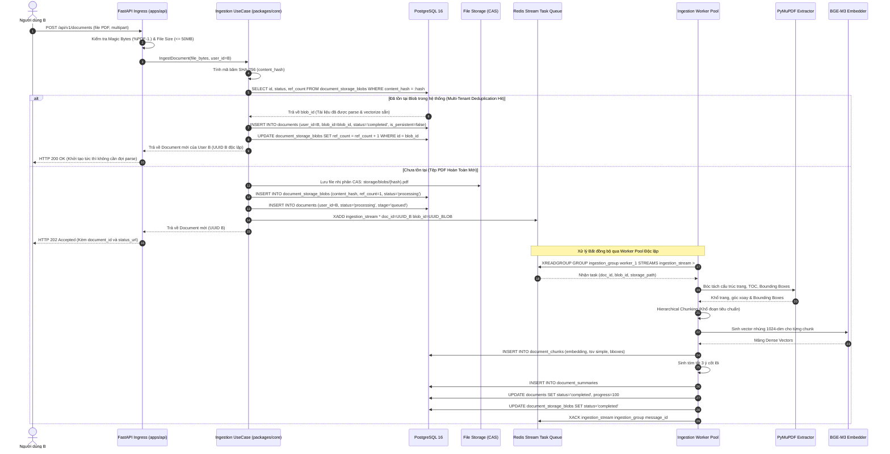
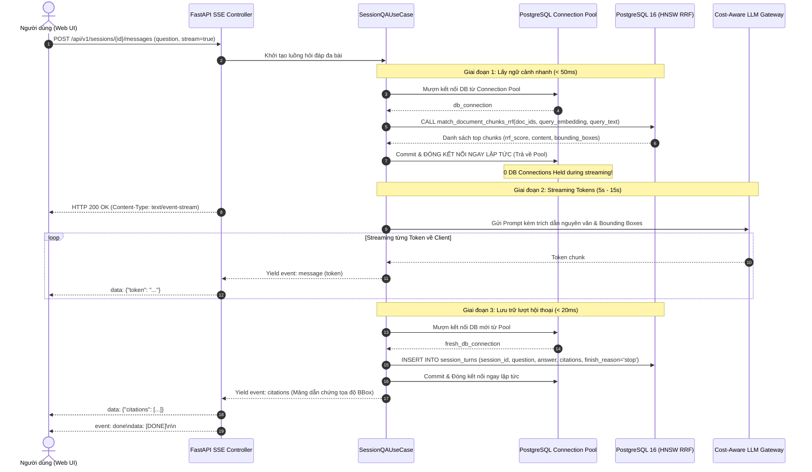
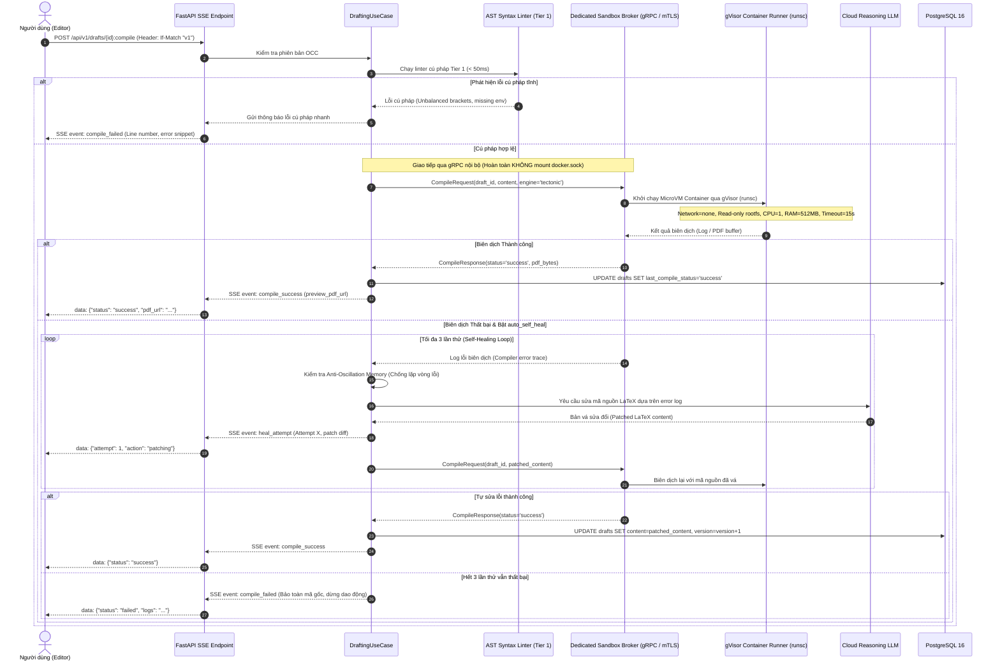
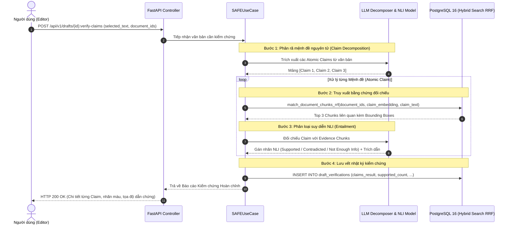

# Thiết Kế Kiến Trúc Hệ Thống & Phần Mềm Toàn Diện (Full System & Software Architecture Specification)

Tài liệu này định nghĩa chi tiết toàn bộ kiến trúc hệ thống (**System Architecture**), kiến trúc phần mềm lục giác (**Hexagonal / Ports & Adapters Architecture**), thiết kế thành phần chi tiết (**Software Component Design**), các luồng dữ liệu đầu-cuối (**End-to-End Data Flow Pipelines**), cấu trúc tổ chức mã nguồn (**Monorepo Blueprint**), và các chốt chặn an ninh hạ tầng phân tán (**Distributed Infrastructure Hardening & Invariants**) cho **toàn bộ 4 Module cốt lõi, Quản lý Phiên nghiên cứu (Session Persistence) và Chia sẻ cộng tác (Public Sharing)** của nền tảng **VeriScholar** dựa trên [PRD.md](file:///home/dammanhdungvn/Downloads/Workspace/VeriScholar/docs/vi/PRD.md), [design-api.md](file:///home/dammanhdungvn/Downloads/Workspace/VeriScholar/docs/vi/design-api.md), và [design-database.md](file:///home/dammanhdungvn/Downloads/Workspace/VeriScholar/docs/vi/design-database.md).

---

## 0. BẢNG THUẬT NGỮ KIẾN TRÚC HỆ THỐNG DÀNH CHO KỸ SƯ MỚI (FRESHER GLOSSARY)

Để giúp các kỹ sư mới (Fresher / Junior) nắm bắt toàn bộ bức tranh kiến trúc phân tán quy mô lớn của VeriScholar mà không gặp khó khăn trước các khái niệm nâng cao, bảng dưới đây giải thích trực quan các thuật ngữ cốt lõi:

| Thuật ngữ | Khái niệm kỹ thuật | Giải thích trực quan cho Fresher |
| :--- | :--- | :--- |
| **Hexagonal Architecture** | Ports & Adapters Architecture | Kiến trúc lục giác: Tách biệt hoàn toàn nghiệp vụ cốt lõi (Domain Core) khỏi công nghệ bên ngoài (FastAPI, PostgreSQL, Redis). Nghiệp vụ chỉ nói chuyện qua các bản hợp đồng (Ports), công nghệ cụ thể được gắn vào qua các bộ điều hợp (Adapters). |
| **Durable Task Queue** | Reliable Background Queue | Hàng đợi tác vụ bền vững (Redis Streams): Ghi tác vụ xuống đĩa an toàn, yêu cầu Worker xác nhận tường minh (Explicit ACK) khi làm xong và chuyển tác vụ hỏng vào hàng đợi thư chết (DLQ), chống hoàn toàn nguy cơ mất tác vụ (Task Evaporation). |
| **Sandbox Broker Service** | Isolated Sandbox Microservice | Dịch vụ biên dịch mã cô lập: Đặt trên máy chủ riêng biệt, tuyệt đối không gắn file socket Docker (`/var/run/docker.sock`) vào máy chủ Web API để ngăn chặn triệt để tin tặc chiếm quyền điều khiển máy chủ (Privilege Escalation). |
| **gVisor (`runsc`)** | Application Kernel Sandbox | Công nghệ ảo hóa an toàn của Google: Tạo ra một lớp bảo vệ bao bọc lấy mã lệnh chạy thử (mã LaTeX, script lạ), ngăn không cho mã độc can thiệp vào nhân hệ điều hành máy chủ. |
| **Early Connection Release** | Early Database Session Release | Cơ chế giải phóng sớm kết nối cơ sở dữ liệu: Khi truyền luồng chữ thời gian thực (SSE) kéo dài 20-30 giây, máy chủ chỉ mượn kết nối cơ sở dữ liệu trong 50 mili-giây đầu để đọc thông tin rồi trả ngay lại bể kết nối (Pool), giúp hệ thống phục vụ hàng ngàn người cùng lúc mà không bị cạn kiệt kết nối. |
| **Multi-Tenant CAS** | Content-Addressable Storage Blob | Lưu trữ tệp theo mã băm SHA-256 kết hợp đếm tham chiếu (`ref_count`): Cho phép nhiều người dùng cùng chia sẻ 1 file PDF vật lý giống nhau trên ổ cứng, nhưng mỗi người vẫn có quyền sở hữu riêng biệt; khi người cuối cùng xóa bài báo thì file vật lý mới bị xóa vĩnh viễn (Zero-Retention). |
| **NLI** | Natural Language Inference | Suy luận ngôn ngữ tự nhiên: Kỹ thuật AI dùng trong thuật toán kiểm chứng sự thật SAFE, so sánh đối chiếu câu viết của người dùng với đoạn văn gốc trong bài báo để xác định câu đó là đúng (Entailment), sai (Contradiction) hay không có bằng chứng (Neutral). |
| **Cycle Breaking** | Graph Loop Prevention | Thuật toán cắt chu trình trong đồ thị trích dẫn: Ngăn chặn vòng lặp vô tận khi duyệt cây tài liệu tham khảo (ví dụ bài báo A trích dẫn bài báo B, và bài báo B lại trích dẫn ngược lại bài báo A). |
| **Sufficiency Gate** | Evidence Completeness Gate | Cổng kiểm tra tính đầy đủ của bằng chứng: Thuật toán AI tự động đánh giá xem các tài liệu được chọn trong thư mục đã đủ thông tin và dữ kiện để trả lời câu hỏi tổng hợp hay chưa trước khi tiến hành viết bài. |
| **Top-Left Normalized Coordinates** | Spatial Coordinate Invariant | Hệ tọa độ chuẩn hóa: Gốc `(0.0, 0.0)` luôn nằm ở góc trên cùng bên trái của trang giấy, tọa độ các góc nằm trong khoảng từ `0.0` đến `1.0`, giúp hiển thị khung highlight chính xác bất kể trang giấy to hay nhỏ. |

---

## 1. KIẾN TRÚC HỆ THỐNG TOÀN CẢNH (HIGH-LEVEL SYSTEM ARCHITECTURE)

Nền tảng VeriScholar được thiết kế theo mô hình phân tầng hướng dịch vụ trong kiến trúc Monorepo (`uv workspace` cho backend Python và `pnpm` cho web frontend TypeScript/React), kết hợp hàng đợi tác vụ bền vững (**Durable Task Queue**), dịch vụ biên dịch cô lập cấp Kernel (**Sandbox Broker Service**), và cơ chế quản trị tài nguyên kết nối cơ sở dữ liệu ngắt sớm (**Early Session Release**).

```mermaid
flowchart TB
    subgraph ClientTier ["🖥️ TẦNG GIAO DIỆN NGƯỜI DÙNG (CLIENT TIER - apps/web)"]
        WebUI["React 19 + Vite (apps/web)<br/>- PDF.js Canvas Viewer (Tọa độ Normalized BBox, Zoom/Pan/Rotation Invariants)<br/>- Table of Contents Tree & Structure Navigator<br/>- Fail-Safe SSE Stream Consumer (Markdown, Citations, Formula Rendering)<br/>- TipTap / Monaco Collaborative LaTeX/Markdown Editor<br/>- Cytoscape / 2D Canvas Citation Graph Viewer (Max 2-hop)<br/>- Smart Notebook & Synthesis Knowledge Digest"]
    end

    subgraph IngressGatewayTier ["🛡️ TẦNG TIẾP NHẬN & ĐIỀU PHỐI (INGRESS & API GATEWAY - apps/api)"]
        FastAPIServer["FastAPI Gateway Application (apps/api)<br/>- Pure ASGI Tracing Middleware (X-Request-ID, TTFB, Client Disconnect HTTP 499)<br/>- Redis Idempotency Filter (24-Hour TTL Caching)<br/>- Leaky Bucket Token Limiter (Bảo vệ API ngoài Crossref / arXiv / S2)<br/>- Multi-Format Stream Engine (Server-Sent Events & Binary File Streaming)<br/>- Early Connection Release Controller (Chống cạn kiệt DB Pool khi SSE kéo dài)"]
    end

    subgraph TaskQueueTier ["📬 TẦNG HÀNG ĐỢI TÁC VỤ BỀN VỮNG (DURABLE TASK QUEUE & WORKERS)"]
        RedisBroker["Redis 7 Streams / ARQ Task Broker<br/>- Transactional Outbox Pattern<br/>- Consumer Groups, Explicit ACK, DLQ (Dead-Letter Queue)<br/>- Chống bốc hơi tác vụ (Task Evaporation Protection)"]
        IngestionWorker["Dedicated Ingestion Worker Pool<br/>- Xử lý bất đồng bộ các tệp PDF lớn (<= 50MB, 100 trang)<br/>- PyMuPDF Layout Analysis, BGE-M3 Dense Embedding<br/>- Tự động khôi phục và Retry khi có sự cố OOM / Worker crash"]
    end

    subgraph HexagonalCoreTier ["🧠 TẦNG NGHIỆP VỤ CỐT LÕI (HEXAGONAL APPLICATION CORE - packages/core)"]
        DomainCore["Application Use Cases & Domain Logic (packages/core)<br/>- Module 1: Multi-Tenant CAS Ingestion, Visual Grounding, Hybrid RAG RRF<br/>- Module 2: Collaborative Drafting, Two-Tier Compiler, SAFE Fact-Checking<br/>- Module 3: Reference Extractor, GraphRAG 2-hop Engine, Cycle Breaker<br/>- Module 4: Hierarchical Library Synthesis, Sufficiency Gate, Matrix Gen<br/>- Sessions: Viewport Sync, 30-Day TTL Lifecycle, OCC Version Guard<br/>- Sharing: Tokenized No-Auth Access, Instant Revocation Engine"]
    end

    subgraph StoragePersistenceTier ["💾 TẦNG LƯU TRỮ & TÌM KIẾM DỮ LIỆU (PERSISTENCE TIER)"]
        PostgresDB["PostgreSQL 16 + pgvector (Container)<br/>- Relational Metadata (documents, turns, drafts, notes...)<br/>- Multi-Tenant Content-Addressable Storage (CAS Blob Reference)<br/>- HNSW Vector Index (vector_cosine_ops, ef_search=100, iterative_scan)<br/>- GIN Sparse Index (to_tsvector 'simple' Full-Text Search)<br/>- Database-Enforced OCC Triggers & Session Capacity Locks (FOR UPDATE)"]
        LocalStorage["Local Object / File Storage (CAS)<br/>- Physical Blobs: storage/blobs/{content_hash}.pdf (Reference Counted)<br/>- Tenant Previews: storage/previews/{draft_id}.pdf<br/>- Path Traversal Shielding via UUID Filenames<br/>- Zero-Retention Physical Unlink khi ref_count = 0"]
    end

    subgraph SandboxBrokerTier ["🔒 TẦNG BIÊN DỊCH CÔ LẬP RIÊNG BIỆT (DEDICATED SANDBOX BROKER)"]
        SandboxService["Dedicated Sandbox Broker Microservice<br/>- Hoàn toàn KHÔNG mount /var/run/docker.sock vào Backend API<br/>- Giao tiếp bảo mật cao qua gRPC nội bộ / mTLS<br/>- Ảo hóa an toàn Kernel bằng gVisor (runsc) hoặc Kata Containers<br/>- Resource Caps: 1 CPU Core, 512MB RAM, 15s Hard Timeout, 64 PIDs<br/>- Anti-Oscillation Patching Memory & Live Cancellation"]
    end

    subgraph InferenceAITier ["🤖 TẦNG SUY LUẬN MÔ HÌNH HỌC THUẬT (INFERENCE GATEWAY TIER)"]
        LLMGateway["Cost-Aware LLM Gateway Router<br/>(packages/core/src/core/infrastructure/llm)"]
        LocalDMR["Local Docker Model Runner (Port 12434)<br/>- llama.cpp / ai/smollm2 (0 USD Token Cost)<br/>- Metadata extraction, Title parsing, Claim decomposition"]
        CloudLLM["Cloud Frontier LLMs<br/>- OpenAI / Anthropic Deep Reasoning Models<br/>- Cross-document Synthesis, NLI Verification, LaTeX Self-Healing"]
        EmbeddingEngine["BGE-M3 Multilingual Embedding Engine<br/>- Dense Vector 1024-dim Normalization"]
    end

    subgraph ExternalAcademicTier ["🌐 TẦNG TÍCH HỢP HỌC THUẬT QUỐC TẾ (EXTERNAL SCHOLAR SERVICES)"]
        CrossrefAPI["Crossref Metadata API"]
        SemanticScholarAPI["Semantic Scholar Academic Graph API"]
        ArxivAPI["arXiv Export Engine"]
        PubMedAPI["NCBI E-utilities / PubMed API"]
    end

    WebUI -->|REST / SSE / Range 206| FastAPIServer
    FastAPIServer -->|Inbound Ports| DomainCore
    DomainCore -->|Đẩy tác vụ ngầm bền vững| RedisBroker
    RedisBroker -->|Consumer Group Pull| IngestionWorker
    IngestionWorker -->|Nhúng vector & bóc tách| DomainCore
    DomainCore -->|SQLAlchemy Async / pgvector| PostgresDB
    DomainCore -->|Binary PDF CAS Stream| LocalStorage
    DomainCore -->|gRPC nội bộ / mTLS (Không dùng docker.sock)| SandboxService
    DomainCore -->|LLM & Vector Invocations| LLMGateway
    LLMGateway -->|Tier 0 Local| LocalDMR
    LLMGateway -->|Tier 3 Cloud| CloudLLM
    LLMGateway -->|Vector Embeddings| EmbeddingEngine
    DomainCore -->|External Resolving via Leaky Bucket| ExternalAcademicTier
```

---

## 2. KIẾN TRÚC PHẦN MỀM LỤC GIÁC & RÀO CHẮN PHÂN TÁCH RANH GIỚI (HEXAGONAL ARCHITECTURE)

Hệ thống tuân thủ nghiêm ngặt kỹ năng **`hexagonal-architecture`**, các quy tắc ranh giới trong **`AGENTS.md`** và các chốt chặn kiểm tra tĩnh **Import Boundaries**:

- **`packages/core` là hạt nhân độc lập (Pure Domain & Application Core):**
  - Chứa Domain Entities, Value Objects, Use Cases (Inbound Ports) và Port Interfaces (Outbound Ports).
  - Thuần túy sử dụng thư viện tiêu chuẩn Python và Pydantic v2 core.
  - **Ranh giới bất biến (Import Boundary Enforcement):** Tuyệt đối **KHÔNG** import FastAPI, Uvicorn, SQLAlchemy, Redis, PyMuPDF, hay Docker. Được kiểm soát tự động bằng linter (`ruff` / `import-linter`).
- **`apps/api` là Driving Adapter:**
  - Tiếp nhận HTTP Request, giải mã multipart/JSON, xác thực Idempotency, gọi Use Cases của `packages/core` và serialize phản hồi chuẩn Envelope (RFC 8288 / AIP-136).
- **`packages/core/src/core/infrastructure` là Driven Adapters:**
  - Hiện thực hóa các Outbound Ports để kết nối với cơ sở dữ liệu (PostgreSQL/SQLAlchemy), Redis, Sandbox Broker qua gRPC, PyMuPDF, và LLM Gateway.
- **Chiều phụ thuộc duy nhất (Dependency Inversion Principle):**
  `Driving Adapters (apps/api) → Application Use Cases (Inbound Ports) → Domain Model ← Driven Adapters (infrastructure)`

```mermaid
flowchart LR
    subgraph DrivingAdapters ["🔌 Driving Adapters (apps/api)"]
        DocRouter["Document API Router"]
        DraftRouter["Drafting & Compile Router"]
        RefRouter["References & Graph Router"]
        LibraryRouter["Library & Folders Router"]
        SessionRouter["Session & Message Router"]
        ShareRouter["Public Share Router"]
        SSEStreamer["SSE Event Streamer"]
    end

    subgraph InboundPorts ["🚪 Inbound Ports / Use Cases (packages/core/application)"]
        IngestDocUC["IngestDocumentUseCase"]
        ParseDocUC["ParseDocumentUseCase"]
        AskSessionUC["AskSessionQuestionUseCase"]
        CompileDraftUC["CompileDraftSandboxUseCase"]
        VerifyClaimsUC["VerifyDraftClaimsUseCase"]
        ResolveRefsUC["ResolveReferencesUseCase"]
        QueryGraphUC["QueryCitationGraphUseCase"]
        SynthesizeLibUC["SynthesizeLibraryUseCase"]
        CompareMatrixUC["GenerateCompareMatrixUseCase"]
        SyncViewportUC["SyncSessionViewportUseCase"]
        AccessShareUC["AccessSharedResourceUseCase"]
    end

    subgraph PureDomainCore ["💎 Pure Domain Entities & Value Objects (packages/core/domain)"]
        DocEntity["Document Entity (Multi-Tenant)"]
        BlobVO["StorageBlob Value Object"]
        ChunkEntity["DocumentChunk Entity"]
        TurnEntity["SessionTurn Entity (1NF)"]
        DraftEntity["Draft Entity (OCC version)"]
        RefEntity["ReferenceItem Entity"]
        EdgeEntity["CitationEdge Entity"]
        NoteEntity["ResearchNote Entity (Frozen Snapshot)"]
        ShareEntity["Share Entity (Tokenized)"]
        BBoxVO["BoundingBox Value Object<br/>[x0, y0, x1, y1, page]"]
        PageDimVO["PageDimensions Value Object<br/>[width_pt, height_pt, rotation_deg]"]
    end

    subgraph OutboundPorts ["🚪 Outbound Ports / Interfaces (packages/core/ports)"]
        DocRepoPort["IDocumentRepository"]
        ChunkRepoPort["IDocumentChunkRepository"]
        SessionRepoPort["IResearchSessionRepository"]
        DraftRepoPort["IDraftRepository"]
        NoteRepoPort["IResearchNoteRepository"]
        RefRepoPort["IReferenceRepository"]
        ShareRepoPort["IShareRepository"]
        TaskQueuePort["ITaskQueueProducer (Redis Streams)"]
        PDFParserPort["IPDFParser (PyMuPDF)"]
        SandboxPort["ISandboxBrokerClient (gRPC)"]
        LLMGatewayPort["ILLMGateway"]
        EmbeddingPort["IEmbeddingService (BGE-M3)"]
        AcademicAPIPort["IAcademicService (Crossref/S2)"]
        StoragePort["IContentAddressableStorage (CAS)"]
    end

    subgraph DrivenAdapters ["🔌 Driven Adapters (packages/core/infrastructure)"]
        SQLDocRepo["PostgresDocumentRepository"]
        SQLChunkRepo["PostgresChunkRepository (pgvector)"]
        SQLSessionRepo["PostgresSessionRepository"]
        SQLDraftRepo["PostgresDraftRepository"]
        RedisStreamAdapter["RedisStreamTaskProducerAdapter"]
        SandboxGRPCAdapter["SandboxBrokerGRPCClientAdapter"]
        PyMuPDFAdapter["PyMuPDFEngineAdapter"]
        BGEEmbeddingAdapter["BGEModelEmbeddingAdapter"]
        HybridLLMAdapter["CostAwareLLMGatewayAdapter"]
        ExternalScholarAdapter["ScholarAPIClientAdapter"]
        LocalCASAdapter["LocalCASStorageAdapter"]
    end

    DocRouter --> IngestDocUC
    DocRouter --> ParseDocUC
    SessionRouter --> AskSessionUC
    SessionRouter --> SyncViewportUC
    DraftRouter --> CompileDraftUC
    DraftRouter --> VerifyClaimsUC
    RefRouter --> ResolveRefsUC
    RefRouter --> QueryGraphUC
    LibraryRouter --> SynthesizeLibUC
    LibraryRouter --> CompareMatrixUC
    ShareRouter --> AccessShareUC

    IngestDocUC --> DocEntity
    IngestDocUC --> StoragePort
    IngestDocUC --> DocRepoPort
    IngestDocUC --> TaskQueuePort

    AskSessionUC --> TurnEntity
    AskSessionUC --> ChunkRepoPort
    AskSessionUC --> LLMGatewayPort
    AskSessionUC --> SessionRepoPort

    CompileDraftUC --> DraftEntity
    CompileDraftUC --> SandboxPort
    CompileDraftUC --> DraftRepoPort

    VerifyClaimsUC --> ChunkRepoPort
    VerifyClaimsUC --> LLMGatewayPort

    SQLDocRepo -.->|Implements| DocRepoPort
    SQLChunkRepo -.->|Implements| ChunkRepoPort
    SQLSessionRepo -.->|Implements| SessionRepoPort
    SQLDraftRepo -.->|Implements| DraftRepoPort
    RedisStreamAdapter -.->|Implements| TaskQueuePort
    SandboxGRPCAdapter -.->|Implements| SandboxPort
    PyMuPDFAdapter -.->|Implements| PDFParserPort
    BGEEmbeddingAdapter -.->|Implements| EmbeddingPort
    HybridLLMAdapter -.->|Implements| LLMGatewayPort
    ExternalScholarAdapter -.->|Implements| AcademicAPIPort
    LocalCASAdapter -.->|Implements| StoragePort
```



---

## 3. THIẾT KẾ CÁC THÀNH PHẦN THEO TỪNG PHÂN HỆ NGHIỆP VỤ

### 3.1. Module 1: Đọc Sâu & Đối Thoại Kép Đa Bài Báo (Deep Reading & Visual Grounding)
1. **Quản Lý Lưu Trữ Nội Dung Đa Người Thuê (Multi-Tenant CAS Deduplication):**
   - **Tách biệt giữa Blob vật lý và Thực thể tài liệu:**
     - Tầng lưu trữ vật lý sử dụng kiến trúc Content-Addressable Storage (CAS): `storage/blobs/{content_hash}.pdf`.
     - Mỗi khi Người dùng B nạp một tệp PDF, hệ thống **luôn luôn tạo một bản ghi `documents` độc lập** mang UUID mới gắn riêng theo `user_id = B`.
     - Nếu phát hiện trùng mã băm `content_hash` (SHA-256) với một tài liệu đã nạp trước đó: Hệ thống tái sử dụng ngay lập tức các vector chunks và siêu dữ liệu bóc tách sẵn, bỏ qua bước parse/embed tốn kém, và tăng số lượng tham chiếu (`ref_count = ref_count + 1`).
     - **Bảo toàn cam kết Zero-Retention:** Khi Người dùng A thực hiện `DELETE /api/v1/documents/{doc_A_id}`, cơ chế `ON DELETE CASCADE` chỉ xóa bản ghi và các dữ liệu gắn với Người dùng A. Dữ liệu của Người dùng B vẫn nguyên vẹn 100%. Tệp PDF vật lý trên đĩa chỉ bị xóa (physical unlinking) khi `ref_count == 0`.
2. **Khử Trôi Dạt Tác Vụ Bằng Hàng Đợi Bền Vững (Redis Streams Task Worker):**
   - Loại bỏ hoàn toàn `FastAPI.BackgroundTasks` in-memory để chống mất tác vụ khi server khởi động lại hoặc worker bị OOM-Killed.
   - Khi tiếp nhận tài liệu, API lưu file CAS, ghi nhận bản ghi `documents(status='processing')` và đẩy message vào **Redis Streams Task Queue** trong một giao dịch nguyên tử.
   - Nhóm tiến trình xử lý độc lập (**Ingestion Worker Pool**) đọc tác vụ qua Consumer Group, hỗ trợ xác nhận xử lý thành công (**Explicit ACK**), tự động thử lại có giãn cách (**Exponential Backoff Retry**), và chuyển vào **Dead-Letter Queue (DLQ)** nếu vượt quá 3 lần thất bại.
3. **Bất Biến Hình Học Tọa Độ Bounding Box (Top-Left Normalized Invariant):**
   - Tọa độ Bounding Box được chuẩn hóa về đoạn thực `[0.0, 1.0]` tương đối với khổ trang gốc:
     `x0_norm = x0_pt / page_width_pt`, `y0_norm = y0_pt / page_height_pt`, với gốc tọa độ `(0,0)` đặt tại góc trên bên trái (**Top-Left**).
   - Số trang `page` tuân thủ quy chuẩn **1-indexed integer** (`page >= 1`).
   - Khổ trang và góc xoay được ghi nhận vào `pages_metadata: [{"page_number": 1, "dimensions": [width_pt, height_pt], "rotation_deg": 0}, ...]` để PDF.js Canvas trên React 19 render overlay chính xác từng pixel.
4. **Hybrid Search RRF Engine & Sổ Tay Nghiên Cứu:**
   - Kết hợp Dense Vector Search (`HNSW Cosine <=>` với `ef_search = 100`, `iterative_scan = 'relaxed'`) và Lexical Search (Full-Text Search qua từ điển đa ngữ `simple` trên PostgreSQL GIN) bằng công thức Reciprocal Rank Fusion:
     `RRF_Score = 1.0 / (60 + Dense_Rank) + 1.0 / (60 + Lexical_Rank)`.
   - Bảng `research_notes` lưu trữ trường `frozen_snapshot JSONB`. Khi bài báo gốc bị xóa, trigger `handle_note_source_detached()` tự động chuyển `is_source_detached = TRUE`, bảo toàn 100% dữ liệu nghiên cứu của người dùng.

---

### 3.2. Module 2: Hỗ Trợ Viết Bài, Biên Dịch Sandbox & Kiểm Chứng SAFE
1. **Kiểm Soát Tài Nguyên Kết Nối Cơ Sở Dữ Liệu Khi Stream SSE (Early Connection Release):**
   - Các tác vụ stream SSE kéo dài (10 đến 60 giây) như hỏi đáp đa bài hoặc biên dịch Sandbox tiềm ẩn nguy cơ làm cạn kiệt Connection Pool cơ sở dữ liệu (`max_connections`) nếu giữ kết nối mở xuyên suốt vòng lặp sinh token.
   - Hệ thống áp dụng quy tắc **Ngắt Kết Nối Sớm (Early Connection Release Invariant)** gồm 3 giai đoạn phân lập:
     - **Giai đoạn 1 (Lấy ngữ cảnh < 50ms):** Nhận request, mượn kết nối từ pool, thực thi hàm Hybrid Search RRF hoặc đọc bản thảo, rồi **ngay lập tức Commit/Close DB Session** để trả kết nối về pool.
     - **Giai đoạn 2 (Streaming Tokens 5s - 15s):** Stream từng token từ LLM hoặc log biên dịch về client qua SSE mà **không nắm giữ bất kỳ kết nối DB nào**.
     - **Giai đoạn 3 (Lưu trữ kết quả < 20ms):** Khi stream kết thúc thành công, mở một session DB mới trong vài mili-giây để ghi nhận bản ghi vào `session_turns` hoặc `drafts`, sau đó đóng lại ngay lập tức.
2. **Kiến Trúc Sandbox Biên Dịch Cô Lập An Toàn (Dedicated Sandbox Broker):**
   - **Triệt tiêu nguy cơ leo thang đặc quyền Host:** Tuyệt đối **KHÔNG** mount `/var/run/docker.sock` vào container backend `apps/api`.
   - Dựng một Microservice **Sandbox Broker** riêng biệt, giao tiếp với backend thông qua gRPC nội bộ hoặc HTTP mTLS bảo mật cao.
   - **Runtime ảo hóa an toàn Kernel:** Sử dụng **gVisor (`runsc`)** hoặc **Kata Containers** để ảo hóa mức kernel cho trình biên dịch TeX, loại trừ triệt để nguy cơ tấn công container breakout.
   - Giới hạn tài nguyên: CPU cap = 1 core, Memory cap = 512MB RAM, Timeout cứng = 15 giây, PID limit = 64, `--network none`, `--read-only rootfs`.
   - Hỗ trợ hủy biên dịch ngay lập tức (`SIGKILL`) khi client ngắt kết nối (`HTTP 499`).
3. **Vòng Lặp Tự Sửa Lỗi AI (Agentic Self-Healing Loop) & Bộ Nhớ Chống Dao Động:**
   - Khi biên dịch thất bại, bộ điều phối trích xuất log lỗi của trình biên dịch và truyền vào mô hình ngôn ngữ chuyên sâu để sinh bản vá lỗi (Patch).
   - Khống chế tối đa **3 lần thử** (`max_heal_attempts = 3`).
   - **Anti-Oscillation Patching Memory:** Lưu vết toàn bộ mã nguồn và mã lỗi của các lượt thử trước. Nếu bản vá mới tạo ra lỗi trùng lặp hoặc lặp lại vòng xoay trạng thái trước đó, cơ chế ngay lập tức dừng sửa tự động, phục hồi bản gần nhất và trả về log chi tiết cho người dùng.
4. **Quy Trình Kiểm Chứng Sự Thật Học Thuật 4 Bước SAFE:**
   - **Bước 1 (Claim Decomposition):** Phân tách văn bản thành các mệnh đề sự thật nguyên tử (Atomic Claims).
   - **Bước 2 (Evidence Retrieval):** Truy xuất các đoạn văn bản chứng cứ liên quan thông qua Hybrid RRF.
   - **Bước 3 (NLI Entailment Classification):** Suy luận logic Natural Language Inference để gán nhãn trạng thái: `Supported`, `Contradicted`, hoặc `Not Enough Info`.
   - **Bước 4 (Audit Trail Logging):** Lưu trữ kết quả kiểm chứng vào bảng `draft_verifications` kèm tọa độ Bounding Box dẫn chứng.

---

### 3.3. Module 3: Khai Thác Tài Liệu Tham Khảo & Đồ Thị Tri Thức (GraphRAG)
1. **Bóc Tách & Chuẩn Hóa Trích Dẫn (Reference Extraction):**
   - Trích xuất danh mục tài liệu tham khảo cuối bài báo bằng mô hình phân tích mẫu (Regex + Layout Analysis).
   - Phân tích cú pháp bóc tách `title`, `authors`, `year`, `doi`, `arxiv_id`.
2. **Cơ Chế Điều Tiết Tốc Độ Gọi API Ngoài (Leaky Bucket Rate Limiter):**
   - Tích hợp bộ điều tiết Leaky Bucket trên Redis để chống vượt hạn ngạch:
     - Crossref: Tối đa 5 requests/giây.
     - Semantic Scholar: Tối đa 1 request/giây (No Key) hoặc 10 requests/giây (Partner Key).
     - PubMed / NCBI: Tối đa 3 requests/giây.
3. **Đồ Thị Tri Thức Trích Dẫn & Bẻ Gãy Chu Trình (Cycle Breaking):**
   - Đồ thị được lưu trong bảng `citation_edges` với các quan hệ: `CITES`, `EXTENDS`, `BENCHMARKS_ON`, `CONTRADICTS`.
   - Khống chế tối đa 2 bước nhảy (`max_depth <= 2`).
   - Thuật toán đệ quy CTE kiểm tra mảng `visited_nodes` để loại bỏ hoàn toàn liên kết vòng tròn (Cycle Breaking) và ngăn ngừa tự trích dẫn (Self-loop).
4. **Bộ Đệm Siêu Dữ Liệu Học Thuật Dùng Chung (Global Academic Cache):**
   - Lưu trữ siêu dữ liệu công khai từ Crossref/arXiv/Semantic Scholar trong bảng `global_academic_cache` với TTL 30 ngày.
   - Rào chắn cách ly dữ liệu cá nhân: Bảng này chỉ phục vụ siêu dữ liệu công khai (`is_public_record = TRUE`), tuyệt đối không lưu trữ tài liệu riêng tư của người dùng.

---

### 3.4. Module 4: Quản Lý Thư Viện Cá Nhân & Tổng Hợp Đa Bài Báo
1. **Cấu Trúc Thư Mục Phân Cấp (Hierarchical Folders):**
   - Quản lý cây thư mục nghiên cứu trong bảng `folders` với quan hệ cha-con (`parent_id`).
   - Áp dụng ràng buộc PostgreSQL 15+ `UNIQUE NULLS NOT DISTINCT (user_id, parent_id, name)` để chống trùng tên thư mục gốc.
2. **Tổng Hợp Đa Bài Phân Tầng (Hierarchical RAG & Sufficiency Gate):**
   - **Tầng 1 (Document Summaries Retrieval):** Truy xuất trên bảng `document_summaries` (tóm tắt 3 ý cốt lõi) của toàn bộ các bài báo trong thư mục hoặc thư viện để tạo bức tranh toàn cảnh mà không gây quá tải Token Budget.
   - **Sufficiency Verification Gate:** Mô hình đánh giá độ đầy đủ thông tin (`sufficiency_score`). Nếu `sufficiency_score >= 0.85`, câu trả lời được sinh trực tiếp từ Tầng 1 (tiết kiệm 70% chi phí và độ trễ).
   - **Tầng 2 (Deep Chunk Fallback):** Nếu `sufficiency_score < 0.85`, hệ thống tự động rơi xuống Tầng 2 để truy xuất các đoạn chunks chi tiết thông qua Hybrid Search RRF.
3. **Dựng Bảng So Sánh Tự Động (Compare Matrix Generation):**
   - Người dùng chọn từ 2 đến 10 bài báo và danh sách các tiêu chí.
   - Hệ thống trích xuất thông tin có cấu trúc và tổng hợp thành bảng Markdown/JSON đối sánh trực quan.

---

### 3.5. Quản Lý Phiên Nghiên Cứu & Chia Sẻ Cộng Tác (Session & Sharing)
1. **Quản Lý Phiên Làm Việc (Research Sessions):**
   - Một phiên làm việc quản lý cụm từ 1 đến 5 bài báo liên quan (`session_documents`).
   - Trigger `enforce_session_capacity()` sử dụng lệnh khóa dòng cha `FOR UPDATE` trên `research_sessions` để tuần tự hóa các yêu cầu nạp bài đồng thời, triệt tiêu hoàn toàn lỗi Write Skew và Phantom Reads.
   - Tự động lưu vết trạng thái người dùng (`viewport_state`: trang hiện tại, tỷ lệ zoom, vị trí cuộn chuột, tab đang mở) kèm khóa lạc quan `version`.
2. **Vòng Đời Phiên & Dọn Dẹp TTL 30 Ngày:**
   - Phiên không có tương tác trong 30 ngày được chuyển sang trạng thái lưu trữ mềm (`is_archived = TRUE`).
   - Người dùng có thể khôi phục phiên bất kỳ lúc nào qua `POST /sessions/{id}:restore-archived`.
   - Worker chạy ngầm định kỳ quét dọn các tài liệu chưa Starred (`is_persistent = FALSE`) quá hạn 30 ngày nhờ Partial Index `idx_documents_ttl_purge`.
3. **Chia Sẻ Tài Nguyên Công Khai (Public Sharing Engine):**
   - Tạo liên kết chia sẻ công khai không cần đăng nhập qua token ngẫu nhiên không thể đoán trước (`sh_{random_token}`).
   - Hỗ trợ endpoint stream PDF nhị phân cho khách xem (`GET /shares/{token}/file`) để PDF.js Canvas hiển thị và vẽ Bounding Box trực tiếp.
   - Thu hồi quyền chia sẻ tức thời (`DELETE /shares/{token}`): Cờ `is_revoked = TRUE` lập tức khiến mọi truy cập công khai trả về mã lỗi `410 Gone`.

---

## 4. CÁC LUỒNG DỮ LIỆU ĐẦU-CUỐI CỐT LÕI (DATA FLOW PIPELINES)

### 4.1. Luồng 1: Tải Lên, Khử Trùng Lặp Multi-Tenant CAS & Hàng Đợi Bền Vững (Ingestion Pipeline)



---

### 4.2. Luồng 2: Đối Thoại Đa Bài Báo & Quản Lý Kết Nối Cơ Sở Dữ Liệu Ngắt Sớm (Early Session Release SSE)



---

### 4.3. Luồng 3: Biên Dịch Bản Thảo Qua Dedicated Sandbox Broker & gVisor Runtime



---

### 4.4. Luồng 4: Kiểm Chứng Sự Thật 4 Bước SAFE (Fact-Checking Pipeline)



---

## 5. PHÂN RÃ CẤU TRÚC MÃ NGUỒN (MONOREPO BLUEPRINT & BOUNDARIES)

Hệ thống được cấu trúc theo mô hình Monorepo với ranh giới phân tách nghiêm ngặt:

```text
/home/dammanhdungvn/Downloads/Workspace/VeriScholar/
├── apps/
│   ├── api/                                  # Driving Adapter: FastAPI Application Layer
│   │   ├── src/
│   │   │   ├── api/
│   │   │   │   ├── middleware/               # Pure ASGI Tracing, TTFB, Client Disconnect (HTTP 499)
│   │   │   │   ├── routes/                   # 59 RESTful Endpoints (AIP-136 Custom Methods)
│   │   │   │   │   ├── v1/
│   │   │   │   │   │   ├── documents.py      # Module 1: Upload, Chunks, Summaries, Notes
│   │   │   │   │   │   ├── drafts.py         # Module 2: Drafting, Sandbox Compile SSE, SAFE Fact-Check
│   │   │   │   │   │   ├── references.py     # Module 3: Reference Resolve, Citation Graph
│   │   │   │   │   │   ├── library.py        # Module 4: Folders, Hierarchical RAG, Matrix
│   │   │   │   │   │   ├── sessions.py       # Sessions: Viewport Sync, Turns, OCC, 30-day TTL
│   │   │   │   │   │   └── shares.py         # Sharing: Unguessable tokens, No-auth stream, Revocation
│   │   │   │   ├── schemas/                  # Pydantic v2 Request / Response Envelopes
│   │   │   │   └── main.py                   # FastAPI Application Entrypoint & CORS
│   │   └── tests/                            # API Integration & E2E Test Suite
│   │
│   ├── sandbox-broker/                       # Dedicated Sandbox Microservice (Isolated Host / Node)
│   │   ├── src/
│   │   │   ├── server.py                     # gRPC / mTLS Server (Hoàn toàn tách biệt với apps/api)
│   │   │   ├── runner.py                     # gVisor (runsc) / Kata Containers Execution Engine
│   │   │   └── linter.py                     # AST Syntax Linter Pre-check Engine
│   │   └── Dockerfile.sandbox                # Hardened MicroVM Container
│   │
│   ├── worker/                               # Ingestion Worker Pool (Durable Task Queue Consumer)
│   │   ├── src/
│   │   │   ├── worker.py                     # Redis Streams Consumer Loop (Explicit ACK, DLQ)
│   │   │   └── tasks/                        # Background Ingestion, Layout Analysis, Embedding
│   │   └── Dockerfile.worker
│   │
│   └── web/                                  # Driving Adapter: React 19 Frontend
│       ├── src/
│       │   ├── components/
│       │   │   ├── viewer/                   # PDF.js Canvas, Normalized BoundingBox Overlays
│       │   │   ├── editor/                   # TipTap / Monaco LaTeX Collaborative Editor
│       │   │   ├── graph/                    # Cytoscape / 2D Canvas Citation Graph Viewer
│       │   │   ├── chat/                     # Fail-safe SSE Markdown Chat with Citation Badges
│       │   │   └── notebook/                 # Smart Notebook & Knowledge Digest UI
│       │   ├── hooks/                        # Custom React Hooks (useSSE, useViewportSync, useOCC)
│       │   └── pages/                        # Module Views (Workspace, Library, Drafting, Share)
│
├── packages/
│   └── core/                                 # Pure Business Domain & Ports & Adapters
│       └── src/
│           └── core/
│               ├── domain/                   # 100% Pure Python Entities & Value Objects (No I/O)
│               │   ├── models/               # Document, Chunk, Turn, Draft, Note, Edge, Folder
│               │   └── value_objects/        # BoundingBox, PageDimensions, Citations, Enums
│               │
│               ├── application/              # Inbound Ports & Use Cases (Business Workflows)
│               │   ├── ingestion/            # IngestDocument, ParsePDF, ExtractStructure
│               │   ├── qa/                   # AskSessionQuestion, StreamSSEHandler
│               │   ├── drafting/             # CompileDraft, SelfHealingLoop, VerifyClaimsSAFE
│               │   ├── citation/             # ResolveReferences, QueryCitationGraph2Hop
│               │   ├── library/              # HierarchicalSynthesis, GenerateCompareMatrix
│               │   └── session/              # SyncViewport, RestoreArchivedSession, ManageShares
│               │
│               ├── ports/                    # Abstract Interfaces (Dependency Inversion)
│               │   ├── repositories.py       # IDocumentRepo, IChunkRepo, ISessionRepo, IDraftRepo
│               │   ├── queue.py              # ITaskQueueProducer (Redis Streams Interface)
│               │   ├── parsers.py            # IPDFParser, IStructureExtractor
│               │   ├── sandbox.py            # ISandboxBrokerClient (gRPC Interface)
│               │   ├── llm.py                # ILLMGateway, IEmbeddingEngine
│               │   └── storage.py            # IContentAddressableStorage (CAS Interface)
│               │
│               └── infrastructure/           # Driven Adapters (Concrete Implementations)
│                   ├── database/             # SQLAlchemy 2.0 Async Models & Repositories
│                   ├── queue/                # Redis Streams Task Queue Producer Adapter
│                   ├── cache/                # Redis Idempotency & Leaky Bucket Limiter
│                   ├── parsers/              # PyMuPDF (fitz) Engine Adapter
│                   ├── sandbox/              # Sandbox Broker gRPC Client Adapter
│                   ├── llm/                  # Cost-Aware LLM Gateway Router (Local DMR / Cloud)
│                   └── storage/              # Local CAS File Storage with Ref-Counted Unlink
│
├── infra/                                    # Infrastructure as Code
│   ├── docker/
│   │   ├── Dockerfile.api                    # FastAPI Backend Container (No docker.sock)
│   │   ├── Dockerfile.sandbox                # gVisor / MicroVM Hardened TeX Container
│   │   └── Dockerfile.web                    # Nginx + React 19 Frontend Container
│   └── docker-compose.yml                    # Local Dev Stack (API, Worker, Broker, Postgres, Redis)
│
├── docs/                                     # Architecture & Engineering Specifications
│   └── vi/
│       ├── PRD.md                            # Product Requirements Document
│       ├── design-api.md                     # 59 Endpoints REST / SSE Specification
│       ├── design-database.md                # PostgreSQL 16 + pgvector DDL Schema
│       └── design-architecture.md            # System & Software Architecture Blueprint
│
├── pyproject.toml                            # uv Workspace Root Configuration
└── AGENTS.md                                 # Agent & Engineering Protocol
```

---

## 6. CÁC NGUYÊN TẮC BẤT BIẾN KỸ THUẬT & AN NINH HẠ TẦNG (INVARIANTS & SECURITY)

1. **Bất Biến Tọa Độ Bounding Box (Top-Left Normalized Coordinate Invariant):**
   - Đơn vị lưu trữ và tính toán là mảng số thực 5 phần tử: `[x0, y0, x1, y1, page]`.
   - `page`: Số nguyên dương bắt đầu từ 1 (`page >= 1`).
   - Tọa độ `x0, y0, x1, y1`: Số thực được chuẩn hóa trong đoạn `[0.0, 1.0]`, gốc tọa độ `(0,0)` đặt tại góc trên bên trái (**Top-Left**).
   - Tuyệt đối không bao giờ loại bỏ Bounding Box hoặc hạ cấp dữ liệu trích dẫn về chuỗi văn bản trần không có neo hình học.
2. **Khử Trùng Lặp Lưu Trữ Đa Người Thuê (Multi-Tenant CAS Deduplication Invariant):**
   - Mọi tệp nạp vào hệ thống đều được băm `SHA-256` để lưu trữ nội dung duy nhất tại tầng vật lý (`storage/blobs/{hash}.pdf`).
   - Mỗi người dùng tải lên luôn được sở hữu một bản ghi `documents` độc lập với UUID riêng biệt.
   - Khi xóa tài liệu, `ON DELETE CASCADE` chỉ xóa bản ghi của người yêu cầu và giảm `ref_count` tại tầng blob. Tệp vật lý chỉ bị xóa sổ khi `ref_count == 0`, bảo vệ 100% quyền riêng tư và cam kết Zero-Retention.
3. **Chống Cạn Kiệt Kết Nối Cơ Sở Dữ Liệu (Early Connection Release Invariant):**
   - Không được giữ kết nối cơ sở dữ liệu mở xuyên suốt các luồng Server-Sent Events (SSE) kéo dài.
   - Luôn đóng DB Session ngay sau khi truy vấn ngữ cảnh RRF (< 50ms), thực hiện stream token độc lập với database, và chỉ mở lại kết nối trong tích tắc (< 20ms) khi cần lưu trữ kết quả.
4. **Cô Lập An Ninh Sandbox Tuyệt Đối (No Host Docker Socket Invariant):**
   - Cấm tuyệt đối việc mount `/var/run/docker.sock` vào container backend `apps/api`.
   - Toàn bộ lệnh biên dịch được chuyển tiếp sang **Sandbox Broker Microservice** độc lập qua gRPC/mTLS, thực thi bên trong container cô lập bằng runtime **gVisor (`runsc`)** hoặc **Kata Containers** với rào chắn: `--network none`, `--read-only rootfs`, `--cap-drop ALL`, CPU cap 1 core, RAM cap 512MB, timeout 15 giây.
5. **Hàng Đợi Tác Vụ Bền Vững (Durable Task Queue Invariant):**
   - Cấm sử dụng `FastAPI.BackgroundTasks` in-memory cho các tác vụ nặng như bóc tách PDF và nhúng vector.
   - Toàn bộ tác vụ bóc tách bắt buộc đi qua **Redis Streams / Task Queue** với cơ chế Explicit ACK, Transactional Outbox, và Dead-Letter Queue (DLQ) để chống trôi dạt tác vụ (Task Evaporation).
6. **Kiểm Soát Đồng Thời Lạc Quan Chuẩn RFC 9110 / RFC 7232 (OCC Invariant):**
   - Các tài nguyên có tính đột biến cao (`drafts`, `research_notes`, `research_sessions`) bắt buộc đối chiếu Header `If-Match: "v{version}"`.
   - Cơ sở dữ liệu sử dụng trigger tự động hóa tăng phiên bản `handle_occ_and_timestamp()`. Nếu xung đột phiên bản xảy ra, hệ thống trả về mã trạng thái `412 Precondition Failed`.
7. **Tuần Tự Hóa Chống Write Skew Trong Phiên Đọc Đa Bài:**
   - Khống chế trần tối đa 5 bài báo trong một phiên nghiên cứu bằng khóa hàng tường minh (`FOR UPDATE`) trên bản ghi `research_sessions` trong trigger `enforce_session_capacity()`.
