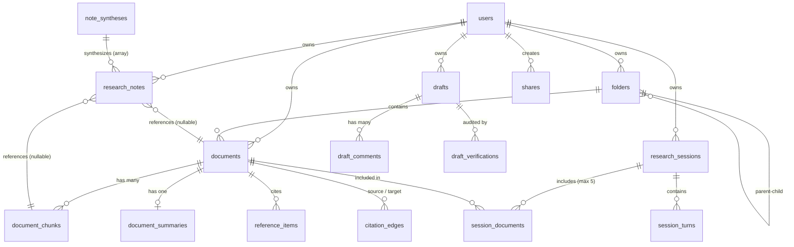

# Thiết Kế Chi Tiết Toàn Bộ Cơ Sở Dữ Liệu - Nền Tảng VeriScholar (PostgreSQL 16 + pgvector)

Tài liệu này định nghĩa chi tiết toàn bộ lược đồ cơ sở dữ liệu (Database Schema DDL), chiến lược phân vùng và lập chỉ mục (Indexing Strategy), tối ưu hóa truy vấn Hybrid Search (Dense + Lexical RRF), cơ chế Khóa Lạc Quan (OCC), kiểm soát tranh chấp đồng thời (Concurrency Control & Row Locks), ràng buộc toàn vẹn đồ thị tri thức (Graph Integrity), và cam kết bảo mật xóa sổ dữ liệu (Zero-Retention Guarantee) cho **toàn bộ 4 Module cốt lõi, Quản lý Phiên nghiên cứu (Session Persistence) và Chia sẻ cộng tác (Public Sharing)** của dự án **VeriScholar** dựa trên [PRD.md](file:///home/dammanhdungvn/Downloads/Workspace/VeriScholar/docs/vi/PRD.md) và [design-api.md](file:///home/dammanhdungvn/Downloads/Workspace/VeriScholar/docs/vi/design-api.md).

---

## 1. MÔ HÌNH DỮ LIỆU TỔNG QUAN (ERD TOÀN HỆ THỐNG)

Hệ thống cơ sở dữ liệu VeriScholar được thiết kế theo chuẩn 3NF và 1NF trên **PostgreSQL 16**, kết hợp chặt chẽ giữa quan hệ bảng, dữ liệu bán cấu trúc (JSONB GIN), vector đa chiều (`pgvector 1024-dim` từ mô hình `BGE-M3`), và Full-Text Search đa ngôn ngữ (`tsvector simple`).



---

## 2. QUY CHUẨN KIỂU DỮ LIỆU & BẤT BIẾN TOÀN CỤC

1. **Khóa Chính (Primary Keys):** Sử dụng kiểu `UUID` sinh ngẫu nhiên qua `gen_random_uuid()` hoặc time-ordered UUIDv7 để chống lộ quy mô hệ thống (IDOR) và triệt tiêu phân mảnh B-Tree (Leaf Page Splits).
2. **Dense Vector Embeddings:** Kiểu `vector(1024)` tương thích với mô hình nhúng đa ngôn ngữ `BGE-M3`.
3. **Bất Biến Bounding Box:** Kiểu `JSONB` với ràng buộc kiểm tra không bao giờ mang giá trị `NULL`. Luôn khởi tạo mặc định bằng `'[]'::jsonb`. Cấu trúc mảng chuẩn: `[[x0, y0, x1, y1, page], ...]`, trong đó `x0, y0, x1, y1` là số thực thuộc đoạn `[0.0, 1.0]` và `page >= 1`.
4. **Bất Biến Khổ Trang & Góc Xoay:** Trường `pages_metadata` trong bảng `documents` lưu trữ mảng JSONB: `[{"page_number": 1, "dimensions": [width_pt, height_pt], "rotation_deg": 0}, ...]` để PDF.js Canvas render khớp tọa độ 100%.
5. **Kiểm Soát Đồng Thời Lạc Quan Bất Biến (Database-Enforced OCC):** Trường `version INT NOT NULL DEFAULT 1` tại các bảng `drafts`, `research_notes`, `research_sessions` được quản trị tự động thông qua Database Trigger `handle_occ_and_timestamp()`. Trigger tự động tăng `NEW.version = OLD.version + 1` nhằm loại bỏ rủi ro tầng ứng dụng quên cập nhật version hoặc câu lệnh SQL raw làm sai lệch chuỗi phiên bản (RFC 9110 / RFC 7232).
6. **Tuần Tự Hóa Chống Write Skew / Phantom Reads:** Ngăn chặn vi phạm trần 5 bài báo trong `session_documents` bằng cơ chế Khóa Hàng Tường Minh (`PERFORM 1 FROM research_sessions WHERE id = NEW.session_id FOR UPDATE`).
7. **Bảo Toàn Bằng Chứng Đóng Băng Tự Động (Automated Note Decoupling):** Khi bài báo gốc bị xóa (`ON DELETE SET NULL`), trigger `handle_note_source_detached()` tự động chuyển `is_source_detached = TRUE` ở tầng cơ sở dữ liệu. Toàn bộ trích dẫn và siêu dữ liệu vẫn bảo toàn nguyên vẹn trong `frozen_snapshot JSONB`.
8. **Chỉ Mục Tiền Tố Bảo Vệ Cascade:** Toàn bộ khóa ngoại `ON DELETE CASCADE` và `ON DELETE SET NULL` đều được trang bị B-Tree Index chuyên dụng để ngăn chặn Sequential Scan và Table Lock contention khi xóa tài liệu.
9. **Chuẩn Ràng Buộc PostgreSQL 15+ `NULLS NOT DISTINCT`:** Bảng `folders` sử dụng `UNIQUE NULLS NOT DISTINCT` để ngăn chặn trùng tên các thư mục gốc có `parent_id IS NULL`.

---

## 3. DDL SCHEMA SPECIFICATION TOÀN BỘ CÁC MODULE

```sql
-- Khởi tạo các Extension cần thiết
CREATE EXTENSION IF NOT EXISTS "uuid-ossp";
CREATE EXTENSION IF NOT EXISTS "pgcrypto";
CREATE EXTENSION IF NOT EXISTS "vector";

-- Trigger tự động cập nhật timestamp và tăng version OCC bất biến
CREATE OR REPLACE FUNCTION handle_occ_and_timestamp()
RETURNS TRIGGER AS $$
BEGIN
    NEW.updated_at = NOW();
    NEW.version = OLD.version + 1;
    RETURN NEW;
END;
$$ LANGUAGE plpgsql;

-- Trigger chỉ cập nhật timestamp cho các bảng không áp dụng OCC
CREATE OR REPLACE FUNCTION update_updated_at_column()
RETURNS TRIGGER AS $$
BEGIN
    NEW.updated_at = NOW();
    RETURN NEW;
END;
$$ LANGUAGE plpgsql;
```

### 3.1. Phân Hệ Người Dùng & Thư Mục (Users & Library Folders)

```sql
-- Bảng users: Định danh người dùng phục vụ phân quyền dữ liệu và giới hạn hạn ngạch
CREATE TABLE users (
    id UUID PRIMARY KEY DEFAULT gen_random_uuid(),
    email VARCHAR(255) NOT NULL UNIQUE,
    full_name VARCHAR(100) NOT NULL,
    hashed_password VARCHAR(255) NOT NULL,
    is_active BOOLEAN NOT NULL DEFAULT TRUE,
    created_at TIMESTAMPTZ NOT NULL DEFAULT NOW(),
    updated_at TIMESTAMPTZ NOT NULL DEFAULT NOW()
);

CREATE TRIGGER trg_users_updated_at
BEFORE UPDATE ON users
FOR EACH ROW EXECUTE FUNCTION update_updated_at_column();

-- Bảng folders: Quản lý thư mục đề tài nghiên cứu phân cấp (Module 4)
-- Áp dụng chuẩn PostgreSQL 15+ NULLS NOT DISTINCT ngăn chặn trùng tên thư mục gốc (parent_id IS NULL)
CREATE TABLE folders (
    id UUID PRIMARY KEY DEFAULT gen_random_uuid(),
    user_id UUID NOT NULL REFERENCES users(id) ON DELETE CASCADE,
    name VARCHAR(255) NOT NULL,
    parent_id UUID NULL REFERENCES folders(id) ON DELETE CASCADE,
    created_at TIMESTAMPTZ NOT NULL DEFAULT NOW(),
    updated_at TIMESTAMPTZ NOT NULL DEFAULT NOW(),
    CONSTRAINT uq_folders_user_parent_name UNIQUE NULLS NOT DISTINCT (user_id, parent_id, name)
);

CREATE INDEX idx_folders_user_parent ON folders(user_id, parent_id);
CREATE TRIGGER trg_folders_updated_at
BEFORE UPDATE ON folders
FOR EACH ROW EXECUTE FUNCTION update_updated_at_column();
```

---

### 3.2. Module 1: Siêu Dữ Liệu Bài Báo, Chunks, Vector & Tóm Tắt

```sql
-- Bảng documents: Lưu trữ bài báo (hỗ trợ cả bài đọc tạm trong Session lẫn Thư viện Starred)
CREATE TABLE documents (
    id UUID PRIMARY KEY DEFAULT gen_random_uuid(),
    user_id UUID NOT NULL REFERENCES users(id) ON DELETE CASCADE,
    folder_id UUID NULL REFERENCES folders(id) ON DELETE SET NULL,
    filename VARCHAR(255) NOT NULL,
    title TEXT NULL,
    authors TEXT[] NULL,
    publication_year INT NULL CHECK (publication_year IS NULL OR publication_year >= 1800),
    doi VARCHAR(255) NULL,
    content_hash VARCHAR(64) NOT NULL, -- SHA-256 mã băm nội dung file chống trùng lặp
    file_size_bytes BIGINT NOT NULL CHECK (file_size_bytes > 0 AND file_size_bytes <= 52428800), -- Max 50MB
    page_count INT NULL CHECK (page_count IS NULL OR page_count > 0),
    chunk_count INT NOT NULL DEFAULT 0 CHECK (chunk_count >= 0),
    pages_metadata JSONB NOT NULL DEFAULT '[]'::jsonb, -- [[page, width_pt, height_pt, rotation_deg], ...]
    parsed_metadata JSONB NULL, -- Cấu trúc TOC, Abstract, Sections bóc tách từ PyMuPDF
    status VARCHAR(30) NOT NULL DEFAULT 'uploaded' 
        CHECK (status IN ('uploaded', 'pending', 'processing', 'completed', 'failed')),
    stage VARCHAR(50) NOT NULL DEFAULT 'queued',
    progress INT NOT NULL DEFAULT 0 CHECK (progress >= 0 AND progress <= 100),
    error_message TEXT NULL,
    is_persistent BOOLEAN NOT NULL DEFAULT FALSE, -- FALSE: Nạp tạm trong session; TRUE: Đã Star vào thư viện
    created_at TIMESTAMPTZ NOT NULL DEFAULT NOW(),
    updated_at TIMESTAMPTZ NOT NULL DEFAULT NOW()
);

CREATE INDEX idx_documents_user_persistent ON documents(user_id, is_persistent);
CREATE INDEX idx_documents_user_folder ON documents(user_id, folder_id);
CREATE INDEX idx_documents_content_hash ON documents(content_hash);
CREATE INDEX idx_documents_status ON documents(status);
CREATE INDEX idx_documents_created_at ON documents(created_at DESC);
CREATE INDEX idx_documents_parsed_metadata ON documents USING gin(parsed_metadata);

-- Partial Index tối ưu hóa cho Worker dọn dẹp các bài báo chưa Star quá hạn TTL 30 ngày
CREATE INDEX idx_documents_ttl_purge ON documents(updated_at) WHERE is_persistent = FALSE;

CREATE TRIGGER trg_documents_updated_at
BEFORE UPDATE ON documents
FOR EACH ROW EXECUTE FUNCTION update_updated_at_column();

-- Bảng document_chunks: Trái tim của RAG (Dense Vector 1024-dim + Sparse Lexical tsvector simple)
-- Sử dụng từ điển 'simple' để tương thích hoàn toàn truy vấn đa ngữ (Cross-Lingual English/Vietnamese)
CREATE TABLE document_chunks (
    id UUID PRIMARY KEY DEFAULT gen_random_uuid(),
    document_id UUID NOT NULL REFERENCES documents(id) ON DELETE CASCADE,
    chunk_index INT NOT NULL CHECK (chunk_index >= 0),
    page_number INT NOT NULL CHECK (page_number >= 1),
    content TEXT NOT NULL,
    bounding_boxes JSONB NOT NULL DEFAULT '[]'::jsonb, -- Non-null invariant: [[x0, y0, x1, y1, page], ...]
    token_count INT NOT NULL CHECK (token_count > 0),
    embedding vector(1024) NOT NULL, -- Dense vector BGE-M3 1024 chiều
    tsv TSVECTOR GENERATED ALWAYS AS (to_tsvector('simple', content)) STORED,
    created_at TIMESTAMPTZ NOT NULL DEFAULT NOW(),
    UNIQUE (document_id, chunk_index)
);

-- Index tìm kiếm Vector HNSW (Cosine Distance: <=>) tối ưu truy vấn < 10ms
CREATE INDEX idx_document_chunks_embedding_hnsw 
ON document_chunks 
USING hnsw (embedding vector_cosine_ops)
WITH (m = 16, ef_construction = 64);

-- Index tìm kiếm từ khóa toàn văn đa ngữ qua GIN
CREATE INDEX idx_document_chunks_tsv ON document_chunks USING gin(tsv);

-- Index kết hợp định vị trang nhanh
CREATE INDEX idx_document_chunks_doc_page ON document_chunks(document_id, page_number);

-- Bảng document_summaries: Tóm tắt 3 ý cốt lõi (1-1 với documents)
CREATE TABLE document_summaries (
    id UUID PRIMARY KEY DEFAULT gen_random_uuid(),
    document_id UUID NOT NULL UNIQUE REFERENCES documents(id) ON DELETE CASCADE,
    problem_statement TEXT NOT NULL,
    problem_citations JSONB NOT NULL DEFAULT '[]'::jsonb,
    contributions TEXT NOT NULL,
    contribution_citations JSONB NOT NULL DEFAULT '[]'::jsonb,
    limitations TEXT NOT NULL,
    limitation_citations JSONB NOT NULL DEFAULT '[]'::jsonb,
    total_tokens INT NOT NULL DEFAULT 0,
    latency_ms INT NOT NULL DEFAULT 0,
    created_at TIMESTAMPTZ NOT NULL DEFAULT NOW(),
    updated_at TIMESTAMPTZ NOT NULL DEFAULT NOW()
);

CREATE TRIGGER trg_document_summaries_updated_at
BEFORE UPDATE ON document_summaries
FOR EACH ROW EXECUTE FUNCTION update_updated_at_column();
```

---

### 3.3. Sổ Tay Nghiên Cứu & AI Tổng Hợp (Smart Notebook & Knowledge Digest)

```sql
-- Bảng research_notes: Sổ tay lưu trích dẫn và ghi chú cá nhân (kèm Frozen Evidence Snapshot)
CREATE TABLE research_notes (
    id UUID PRIMARY KEY DEFAULT gen_random_uuid(),
    user_id UUID NOT NULL REFERENCES users(id) ON DELETE CASCADE,
    document_id UUID NULL REFERENCES documents(id) ON DELETE SET NULL,
    chunk_id UUID NULL REFERENCES document_chunks(id) ON DELETE SET NULL,
    selected_text TEXT NOT NULL,
    bounding_boxes JSONB NOT NULL DEFAULT '[]'::jsonb,
    page_number INT NOT NULL CHECK (page_number >= 1),
    user_note TEXT NULL,
    tags TEXT[] NOT NULL DEFAULT '{}',
    frozen_snapshot JSONB NOT NULL DEFAULT '{}'::jsonb, -- Bảo toàn dẫn chứng gốc nếu bài báo bị xóa
    is_source_detached BOOLEAN NOT NULL DEFAULT FALSE, -- Tự động đổi thành TRUE khi bài báo gốc bị xóa
    version INT NOT NULL DEFAULT 1, -- Khóa lạc quan (OCC)
    created_at TIMESTAMPTZ NOT NULL DEFAULT NOW(),
    updated_at TIMESTAMPTZ NOT NULL DEFAULT NOW()
);

-- B-Tree Index tiền tố bảo vệ hiệu năng thao tác ON DELETE SET NULL, ngăn chặn triệt để Table Lock / Sequential Scan
CREATE INDEX idx_research_notes_doc_fk ON research_notes(document_id);
CREATE INDEX idx_research_notes_chunk_fk ON research_notes(chunk_id);
CREATE INDEX idx_research_notes_user_doc ON research_notes(user_id, document_id);
CREATE INDEX idx_research_notes_tags ON research_notes USING gin(tags);
CREATE INDEX idx_research_notes_created ON research_notes(created_at DESC);

CREATE TRIGGER trg_research_notes_occ
BEFORE UPDATE ON research_notes
FOR EACH ROW EXECUTE FUNCTION handle_occ_and_timestamp();

-- Tự động hóa bất biến is_source_detached = TRUE khi bài báo gốc bị xóa sổ (ON DELETE SET NULL)
CREATE OR REPLACE FUNCTION handle_note_source_detached()
RETURNS TRIGGER AS $$
BEGIN
    IF OLD.document_id IS NOT NULL AND NEW.document_id IS NULL THEN
        NEW.is_source_detached = TRUE;
    END IF;
    RETURN NEW;
END;
$$ LANGUAGE plpgsql;

CREATE TRIGGER trg_research_notes_detached
BEFORE UPDATE OF document_id ON research_notes
FOR EACH ROW EXECUTE FUNCTION handle_note_source_detached();

-- Bảng note_syntheses: AI Tổng hợp ghi chú thành bài học / đúc kết tri thức
CREATE TABLE note_syntheses (
    id UUID PRIMARY KEY DEFAULT gen_random_uuid(),
    user_id UUID NOT NULL REFERENCES users(id) ON DELETE CASCADE,
    title VARCHAR(255) NOT NULL,
    mode VARCHAR(50) NOT NULL CHECK (mode IN ('concept_lesson', 'literature_review', 'research_gap')),
    language VARCHAR(10) NOT NULL DEFAULT 'vi',
    markdown_content TEXT NOT NULL,
    interactive_badges JSONB NOT NULL DEFAULT '[]'::jsonb,
    source_note_ids UUID[] NOT NULL DEFAULT '{}',
    created_at TIMESTAMPTZ NOT NULL DEFAULT NOW(),
    updated_at TIMESTAMPTZ NOT NULL DEFAULT NOW()
);

CREATE INDEX idx_note_syntheses_user ON note_syntheses(user_id, created_at DESC);
CREATE TRIGGER trg_note_syntheses_updated_at
BEFORE UPDATE ON note_syntheses
FOR EACH ROW EXECUTE FUNCTION update_updated_at_column();
```

---

### 3.4. Quản Lý Phiên Nghiên Cứu Đa Bài Báo (Research Sessions)

```sql
-- Bảng research_sessions: Phiên nghiên cứu đa bài (1 - 5 bài báo)
CREATE TABLE research_sessions (
    id UUID PRIMARY KEY DEFAULT gen_random_uuid(),
    user_id UUID NOT NULL REFERENCES users(id) ON DELETE CASCADE,
    title VARCHAR(255) NOT NULL,
    active_document_id UUID NULL REFERENCES documents(id) ON DELETE SET NULL,
    viewport_state JSONB NOT NULL DEFAULT '{"page": 1, "zoom_ratio": 1.0, "scroll_top": 0.0}'::jsonb,
    active_tab VARCHAR(30) NOT NULL DEFAULT 'chat' CHECK (active_tab IN ('chat', 'notes', 'summary', 'graph', 'draft')),
    is_archived BOOLEAN NOT NULL DEFAULT FALSE, -- Chuyển sang TRUE khi quá hạn TTL 30 ngày
    archived_at TIMESTAMPTZ NULL,
    version INT NOT NULL DEFAULT 1, -- Khóa lạc quan (OCC) cho PATCH title và viewport
    created_at TIMESTAMPTZ NOT NULL DEFAULT NOW(),
    updated_at TIMESTAMPTZ NOT NULL DEFAULT NOW()
);

CREATE INDEX idx_sessions_user_archived ON research_sessions(user_id, is_archived, updated_at DESC);

CREATE TRIGGER trg_research_sessions_occ
BEFORE UPDATE ON research_sessions
FOR EACH ROW EXECUTE FUNCTION handle_occ_and_timestamp();

-- Bảng session_documents: Bảng liên kết N-N giữa Session và Document (Ràng buộc tối đa 5 bài báo)
CREATE TABLE session_documents (
    session_id UUID NOT NULL REFERENCES research_sessions(id) ON DELETE CASCADE,
    document_id UUID NOT NULL REFERENCES documents(id) ON DELETE CASCADE,
    display_order INT NOT NULL DEFAULT 0,
    added_at TIMESTAMPTZ NOT NULL DEFAULT NOW(),
    PRIMARY KEY (session_id, document_id)
);

CREATE INDEX idx_session_docs_doc ON session_documents(document_id);

-- Ngăn chặn triệt để Phantom Reads & Write Skew bằng Row-Level Locking trên bản ghi cha
CREATE OR REPLACE FUNCTION enforce_session_capacity()
RETURNS TRIGGER AS $$
DECLARE
    doc_count INT;
BEGIN
    -- Khóa dòng cha để tuần tự hóa các yêu cầu nạp tài liệu đồng thời
    PERFORM 1 FROM research_sessions 
    WHERE id = NEW.session_id 
    FOR UPDATE;

    SELECT COUNT(*) INTO doc_count 
    FROM session_documents 
    WHERE session_id = NEW.session_id;

    IF doc_count >= 5 THEN
        RAISE EXCEPTION 'SESSION_CAPACITY_EXCEEDED: Phiên đọc tối đa chỉ chứa 5 bài báo. Vui lòng gỡ bớt bài báo trước khi nạp thêm.'
            USING ERRCODE = 'check_violation';
    END IF;
    RETURN NEW;
END;
$$ LANGUAGE plpgsql;

CREATE TRIGGER trg_enforce_session_capacity
BEFORE INSERT ON session_documents
FOR EACH ROW EXECUTE FUNCTION enforce_session_capacity();

-- Bảng session_turns: Chuẩn hóa 1NF đại diện cho một lượt hỏi - đáp nguyên tử
CREATE TABLE session_turns (
    id UUID PRIMARY KEY DEFAULT gen_random_uuid(),
    session_id UUID NOT NULL REFERENCES research_sessions(id) ON DELETE CASCADE,
    question TEXT NOT NULL,
    answer TEXT NOT NULL,
    citations JSONB NOT NULL DEFAULT '[]'::jsonb, -- [{citation_id, document_id, page_number, bounding_boxes, score}]
    prompt_tokens INT NOT NULL DEFAULT 0,
    completion_tokens INT NOT NULL DEFAULT 0,
    latency_ms INT NOT NULL DEFAULT 0,
    finish_reason VARCHAR(30) NOT NULL DEFAULT 'stop' 
        CHECK (finish_reason IN ('stop', 'length', 'content_filter', 'abstention')),
    created_at TIMESTAMPTZ NOT NULL DEFAULT NOW()
);

CREATE INDEX idx_session_turns_session_created ON session_turns(session_id, created_at ASC);
```

---

### 3.5. Module 2: Hỗ Trợ Viết Bài, Kiểm Chứng Fact-Checking SAFE & Phản Biện Nhóm

```sql
-- Bảng drafts: Quản lý bản thảo bài báo (LaTeX / Markdown)
CREATE TABLE drafts (
    id UUID PRIMARY KEY DEFAULT gen_random_uuid(),
    user_id UUID NOT NULL REFERENCES users(id) ON DELETE CASCADE,
    title VARCHAR(255) NOT NULL,
    format VARCHAR(20) NOT NULL DEFAULT 'latex' CHECK (format IN ('latex', 'markdown')),
    template VARCHAR(50) NOT NULL DEFAULT 'ieee_conference',
    content TEXT NOT NULL,
    version INT NOT NULL DEFAULT 1, -- Khóa lạc quan (OCC) cho PUT và PATCH bản thảo
    last_compiled_at TIMESTAMPTZ NULL,
    last_compile_status VARCHAR(30) NULL 
        CHECK (last_compile_status IS NULL OR last_compile_status IN ('success', 'failed', 'timeout')),
    pdf_preview_storage_path TEXT NULL,
    created_at TIMESTAMPTZ NOT NULL DEFAULT NOW(),
    updated_at TIMESTAMPTZ NOT NULL DEFAULT NOW()
);

CREATE INDEX idx_drafts_user_updated ON drafts(user_id, updated_at DESC);

CREATE TRIGGER trg_drafts_occ
BEFORE UPDATE ON drafts
FOR EACH ROW EXECUTE FUNCTION handle_occ_and_timestamp();

-- Bảng draft_comments: Bình luận phản biện nhóm trên từng dòng/câu (Reviewer Mode)
CREATE TABLE draft_comments (
    id UUID PRIMARY KEY DEFAULT gen_random_uuid(),
    draft_id UUID NOT NULL REFERENCES drafts(id) ON DELETE CASCADE,
    user_id UUID NOT NULL REFERENCES users(id) ON DELETE CASCADE,
    author_name VARCHAR(100) NOT NULL,
    line_number INT NOT NULL CHECK (line_number >= 1),
    selected_text TEXT NOT NULL,
    comment TEXT NOT NULL,
    status VARCHAR(20) NOT NULL DEFAULT 'open' CHECK (status IN ('open', 'resolved')),
    created_at TIMESTAMPTZ NOT NULL DEFAULT NOW(),
    updated_at TIMESTAMPTZ NOT NULL DEFAULT NOW()
);

CREATE INDEX idx_draft_comments_draft_line ON draft_comments(draft_id, line_number);
CREATE TRIGGER trg_draft_comments_updated_at
BEFORE UPDATE ON draft_comments
FOR EACH ROW EXECUTE FUNCTION update_updated_at_column();

-- Bảng draft_verifications: Nhật ký kiểm chứng sự thật SAFE (Fact-Checking Audit Trail)
CREATE TABLE draft_verifications (
    id UUID PRIMARY KEY DEFAULT gen_random_uuid(),
    draft_id UUID NOT NULL REFERENCES drafts(id) ON DELETE CASCADE,
    selected_text TEXT NOT NULL,
    claims_result JSONB NOT NULL DEFAULT '[]'::jsonb, -- Mảng mệnh đề phân rã, NLI status, Bounding Box dẫn chứng
    total_claims INT NOT NULL DEFAULT 0,
    supported_count INT NOT NULL DEFAULT 0,
    contradicted_count INT NOT NULL DEFAULT 0,
    not_enough_info_count INT NOT NULL DEFAULT 0,
    created_at TIMESTAMPTZ NOT NULL DEFAULT NOW()
);

CREATE INDEX idx_draft_verifications_draft ON draft_verifications(draft_id, created_at DESC);
```

---

### 3.6. Module 3: Khai Thác Tài Liệu Tham Khảo, Đồ Thị Tri Thức & Cache Học Thuật

```sql
-- Bảng reference_items: Danh mục tài liệu tham khảo bóc tách từ bài báo gốc
CREATE TABLE reference_items (
    id UUID PRIMARY KEY DEFAULT gen_random_uuid(),
    document_id UUID NOT NULL REFERENCES documents(id) ON DELETE CASCADE,
    ref_index INT NOT NULL CHECK (ref_index >= 1),
    raw_text TEXT NOT NULL,
    parsed_title TEXT NULL,
    parsed_authors TEXT[] NULL,
    parsed_year INT NULL,
    doi VARCHAR(255) NULL,
    arxiv_id VARCHAR(50) NULL,
    resolved_document_id UUID NULL REFERENCES documents(id) ON DELETE SET NULL,
    created_at TIMESTAMPTZ NOT NULL DEFAULT NOW(),
    UNIQUE (document_id, ref_index)
);

CREATE INDEX idx_reference_items_doc ON reference_items(document_id);
CREATE INDEX idx_reference_items_doi ON reference_items(doi) WHERE doi IS NOT NULL;
CREATE INDEX idx_reference_items_arxiv ON reference_items(arxiv_id) WHERE arxiv_id IS NOT NULL;

-- Bảng citation_edges: Đồ thị tri thức trích dẫn (Khống chế k-hop <= 2, Cycle Breaking)
CREATE TABLE citation_edges (
    id UUID PRIMARY KEY DEFAULT gen_random_uuid(),
    source_document_id UUID NOT NULL REFERENCES documents(id) ON DELETE CASCADE,
    target_document_id UUID NOT NULL REFERENCES documents(id) ON DELETE CASCADE,
    relation VARCHAR(50) NOT NULL DEFAULT 'CITES' 
        CHECK (relation IN ('CITES', 'EXTENDS', 'BENCHMARKS_ON', 'CONTRADICTS')),
    confidence FLOAT NOT NULL DEFAULT 1.0 CHECK (confidence >= 0.0 AND confidence <= 1.0),
    created_at TIMESTAMPTZ NOT NULL DEFAULT NOW(),
    UNIQUE (source_document_id, target_document_id, relation),
    CHECK (source_document_id <> target_document_id) -- Chống tự trích dẫn chính mình (Self-loop)
);

CREATE INDEX idx_citation_edges_source ON citation_edges(source_document_id);
CREATE INDEX idx_citation_edges_target ON citation_edges(target_document_id);

-- Bảng global_academic_cache: Bộ đệm siêu dữ liệu học thuật dùng chung (< 10ms Cache Hit)
-- CÁCH LY TUYỆT ĐỐI: Chỉ lưu trữ siêu dữ liệu công khai từ Crossref, Semantic Scholar, arXiv, PubMed.
-- Tuyệt đối không bao giờ lưu trữ bản thảo riêng tư của người dùng vào bảng này.
CREATE TABLE global_academic_cache (
    identifier VARCHAR(255) PRIMARY KEY, -- Chuẩn hóa dạng: 'doi:10.1145/...' hoặc 'arxiv:1706.03762'
    title TEXT NOT NULL,
    authors JSONB NOT NULL DEFAULT '[]'::jsonb,
    publication_year INT NULL,
    venue TEXT NULL,
    citation_count INT NOT NULL DEFAULT 0,
    has_open_access_pdf BOOLEAN NOT NULL DEFAULT FALSE,
    pdf_download_url TEXT NULL,
    abstract TEXT NULL,
    is_public_record BOOLEAN NOT NULL DEFAULT TRUE, -- Rào chắn cách ly dữ liệu
    fetched_at TIMESTAMPTZ NOT NULL DEFAULT NOW(),
    expires_at TIMESTAMPTZ NOT NULL DEFAULT (NOW() + INTERVAL '30 days')
);

CREATE INDEX idx_academic_cache_expires ON global_academic_cache(expires_at);
```

---

### 3.7. Phân Hệ Chia Sẻ Cộng Tác Công Khai (Public Sharing)

```sql
-- Bảng shares: Quản lý liên kết chia sẻ công khai không cần đăng nhập (No Auth)
CREATE TABLE shares (
    token VARCHAR(64) PRIMARY KEY, -- Token ngẫu nhiên unguessable: sh_...
    user_id UUID NOT NULL REFERENCES users(id) ON DELETE CASCADE,
    resource_type VARCHAR(30) NOT NULL 
        CHECK (resource_type IN ('note_synthesis', 'draft', 'document', 'folder')),
    resource_id UUID NOT NULL,
    allow_comments BOOLEAN NOT NULL DEFAULT FALSE,
    is_revoked BOOLEAN NOT NULL DEFAULT FALSE, -- TRUE: Thu hồi chia sẻ tức thời -> Trả về 410 Gone
    expires_at TIMESTAMPTZ NULL,
    created_at TIMESTAMPTZ NOT NULL DEFAULT NOW(),
    revoked_at TIMESTAMPTZ NULL
);

CREATE INDEX idx_shares_resource ON shares(resource_type, resource_id);
CREATE INDEX idx_shares_user ON shares(user_id, created_at DESC);
```

---

## 4. CHIẾN LƯỢC TRUY VẤN HYBRID SEARCH NÂNG CAO (RRF & ITERATIVE SCAN)

Để đạt mục tiêu **Zero-Hallucination**, bảo đảm độ phủ `Context Recall >= 0.90` trên chỉ mục HNSW và hỗ trợ trơn tru câu hỏi đa ngữ tiếng Việt / tiếng Anh, hệ thống tích hợp Dense Vector Search (`HNSW Cosine` với `ef_search = 100`, `iterative_scan = 'relaxed'`) và Lexical Keyword Search (`tsvector simple`) thông qua thuật toán Reciprocal Rank Fusion (RRF):

```sql
CREATE OR REPLACE FUNCTION match_document_chunks_rrf(
    p_document_ids UUID[],
    p_query_embedding vector(1024),
    p_query_text TEXT,
    p_candidate_limit INT DEFAULT 40,
    p_final_limit INT DEFAULT 8
)
RETURNS TABLE (
    chunk_id UUID,
    document_id UUID,
    chunk_index INT,
    page_number INT,
    content TEXT,
    bounding_boxes JSONB,
    token_count INT,
    rrf_score FLOAT
) AS $$
BEGIN
    -- Mở rộng không gian duyệt HNSW trong session giao dịch
    SET LOCAL hnsw.ef_search = 100;
    
    -- Kích hoạt quét lặp trên pgvector 0.7+ để không bỏ sót vector khi có bộ lọc metadata
    BEGIN
        SET LOCAL hnsw.iterative_scan = 'relaxed';
    EXCEPTION WHEN OTHERS THEN
        -- Bỏ qua nếu môi trường đang chạy bản pgvector cũ hơn
    END;

    RETURN QUERY
    WITH semantic_search AS (
        SELECT 
            c.id,
            ROW_NUMBER() OVER (ORDER BY c.embedding <=> p_query_embedding) AS rank
        FROM document_chunks c
        WHERE c.document_id = ANY(p_document_ids)
        ORDER BY c.embedding <=> p_query_embedding
        LIMIT p_candidate_limit
    ),
    lexical_search AS (
        SELECT 
            c.id,
            ROW_NUMBER() OVER (ORDER BY ts_rank_cd(c.tsv, plainto_tsquery('simple', p_query_text)) DESC) AS rank
        FROM document_chunks c
        WHERE c.document_id = ANY(p_document_ids)
          AND c.tsv @@ plainto_tsquery('simple', p_query_text)
        ORDER BY ts_rank_cd(c.tsv, plainto_tsquery('simple', p_query_text)) DESC
        LIMIT p_candidate_limit
    )
    SELECT 
        c.id AS chunk_id,
        c.document_id,
        c.chunk_index,
        c.page_number,
        c.content,
        c.bounding_boxes,
        c.token_count,
        (
            COALESCE(1.0 / (60.0 + s.rank), 0.0) + 
            COALESCE(1.0 / (60.0 + l.rank), 0.0)
        )::FLOAT AS rrf_score
    FROM document_chunks c
    LEFT JOIN semantic_search s ON c.id = s.id
    LEFT JOIN lexical_search l ON c.id = l.id
    WHERE s.id IS NOT NULL OR l.id IS NOT NULL
    ORDER BY rrf_score DESC
    LIMIT p_final_limit;
END;
$$ LANGUAGE plpgsql;
```

---

## 5. THUẬT TOÁN ĐỒ THỊ: NGẮT CHU TRÌNH & KHỐNG CHẾ MAX 2-HOP (CYCLE BREAKING)

Để đảm bảo hiệu năng và ngăn chặn bẫy vòng lặp vô hạn (Infinite Loop) khi truy vấn đồ thị trích dẫn, hệ thống sử dụng truy vấn đệ quy CTE có cơ chế kiểm soát mảng `visited_nodes` và khống chế độ sâu tối đa `depth <= 2`:

```sql
CREATE OR REPLACE FUNCTION get_citation_graph_2hop(
    p_root_document_id UUID,
    p_max_depth INT DEFAULT 2
)
RETURNS TABLE (
    source_id UUID,
    target_id UUID,
    relation VARCHAR(50),
    confidence FLOAT,
    depth INT
) AS $$
BEGIN
    RETURN QUERY
    WITH RECURSIVE citation_cte AS (
        -- Base Case: Điểm bắt đầu từ tài liệu gốc
        SELECT 
            e.source_document_id,
            e.target_document_id,
            e.relation,
            e.confidence,
            1 AS depth,
            ARRAY[e.source_document_id, e.target_document_id] AS visited_nodes
        FROM citation_edges e
        WHERE e.source_document_id = p_root_document_id

        UNION ALL

        -- Recursive Step: Mở rộng các bậc tiếp theo có kiểm tra chu trình
        SELECT 
            e.source_document_id,
            e.target_document_id,
            e.relation,
            e.confidence,
            c.depth + 1,
            c.visited_nodes || e.target_document_id
        FROM citation_edges e
        INNER JOIN citation_cte c ON e.source_document_id = c.target_document_id
        WHERE c.depth < p_max_depth
          AND NOT (e.target_document_id = ANY(c.visited_nodes)) -- Bẻ gãy liên kết vòng tròn (Cycle Breaking)
    )
    SELECT DISTINCT 
        c.source_document_id AS source_id,
        c.target_document_id AS target_id,
        c.relation,
        c.confidence,
        c.depth
    FROM citation_cte c;
END;
$$ LANGUAGE plpgsql;
```

---

## 6. QUẢN TRỊ BẢO MẬT, TOÀN VẸN GIAO DỊCH & ZERO-RETENTION

1. **Cam Kết Xóa Sổ Tuyệt Đối (Zero-Retention Guarantee):**
   - Mọi liên kết từ `documents` tới `document_chunks`, `document_summaries`, `session_documents`, `draft_verifications` đều sử dụng ràng buộc `ON DELETE CASCADE`.
   - Bổ sung các chỉ mục khóa ngoại tiền tố (`idx_research_notes_doc_fk`, `idx_research_notes_chunk_fk`) giúp việc thực thi `ON DELETE SET NULL` diễn ra tức thì thông qua Index Lookup, loại bỏ hoàn toàn nguy cơ Sequential Scan và Table Lock contention trên API `DELETE /documents/{id}`.
2. **Bảo Tồn Dữ Liệu Sổ Tay Thông Minh (Non-destructive Note Decoupling):**
   - Trong bảng `research_notes`, khóa ngoại `document_id` và `chunk_id` được cấu hình `ON DELETE SET NULL`.
   - Khi tài liệu gốc bị xóa, trigger `handle_note_source_detached()` tự động kích hoạt chuyển cờ `is_source_detached = TRUE` ở tầng database. Dữ liệu trích dẫn và tọa độ Bounding Box vẫn được bảo toàn nguyên vẹn trong trường `frozen_snapshot JSONB`, giúp người dùng không bao giờ bị mất ghi chú hoặc công thức toán quý giá.
3. **Phân Tách Ranh Giới Bộ Đệm Công Khai và Riêng Tư (Tenant Cache Isolation):**
   - Bảng `global_academic_cache` độc lập hoàn toàn với dữ liệu cá nhân của người dùng, chỉ lưu trữ các thực thể công khai từ Crossref, Semantic Scholar, arXiv, PubMed.
   - Các bản thảo người dùng tự viết trong bảng `drafts` hoặc PDF tải lên được cô lập theo `user_id` và tuyệt đối không bao giờ được đưa vào bảng cache công cộng.
4. **Kiểm Soát Phiên Bản Khóa Lạc Quan Tự Động (Database-Enforced OCC):**
   - Trigger `handle_occ_and_timestamp()` tự động tăng `version` khi có lệnh UPDATE hợp lệ.
   - Các thao tác cập nhật trên `drafts`, `research_notes`, `research_sessions` bắt buộc thực hiện kiểm tra `WHERE id = :id AND version = :if_match_version`.
   - Nếu không có hàng nào được cập nhật (`ROW_COUNT == 0`), ứng dụng lập tức trả về mã lỗi `412 Precondition Failed` (kèm mã nghiệp vụ `CONCURRENCY_CONFLICT`).
